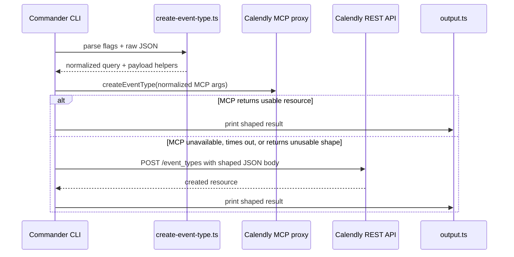

# feat: Add create-event-type command

## Overview

Add a handwritten `calendly create-event-type` command that creates Calendly event types using the documented Calendly MCP tool first and falls back to `POST /event_types` when MCP is unavailable. Ship a stable CLI around verified API fields instead of inventing undocumented create behavior.

## Problem Frame

Issue #29 asks for CLI creation of booking page templates so users can spin up new event types without using the Calendly UI. The repo already supports listing, fetching, updating, and checking availability for event types, so create is the missing piece in the event-type management set. The command needs to fit the repo's handwritten command overlay, preserve help routing, and keep REST fallback behavior aligned with existing command patterns.

## Requirements Trace

- R1. Add a new `create-event-type` command and `create_event_type` alias.
- R2. Follow the existing handwritten event-type command pattern: dedicated query normalizer/shaper module, unit tests, MCP-first execution, REST fallback, and safe error messages.
- R3. Support only create fields verified in Calendly's current API docs: `owner`, `name`, optional `active`, `description`, `duration`, `duration_options`, `locations`, `color`, and `locale`.
- R4. Preserve owner ergonomics by accepting `--user-uri` and `--team-uri` and normalizing them into the API's `owner` field.
- R5. Update CLI help, command routing, and README documentation for the new command.
- R6. Run repo-required verification: tests, top-level help, command help, and live smoke validation when safe.

## Scope Boundaries

- Do not add undocumented create flags from the issue body such as `--slug`, `--secret`, `--buffer-before`, or `--buffer-after`.
- Do not regenerate or hand-edit [`src/generated/cli.ts`](/Users/kesslerio/.codex/worktrees/787e/calendly-cli-openclaw-skill/src/generated/cli.ts); this change belongs in the handwritten overlay.
- Do not broaden the command to team, collective, or round-robin event type creation; Calendly documents create as solo-only today.

## Context & Research

### Relevant Code and Patterns

- [`src/commands/register-event-types.ts`](/Users/kesslerio/.codex/worktrees/787e/calendly-cli-openclaw-skill/src/commands/register-event-types.ts): handwritten event-type commands, shared fetch helpers, MCP-first with REST fallback.
- [`src/update-event-type.ts`](/Users/kesslerio/.codex/worktrees/787e/calendly-cli-openclaw-skill/src/update-event-type.ts): query normalization, payload shaping, and safe error mapping for an event-type write command.
- [`src/update-event-type.test.ts`](/Users/kesslerio/.codex/worktrees/787e/calendly-cli-openclaw-skill/src/update-event-type.test.ts): test structure for normalization and result shaping.
- [`src/commands/run-cli.ts`](/Users/kesslerio/.codex/worktrees/787e/calendly-cli-openclaw-skill/src/commands/run-cli.ts) and [`src/commands/program.ts`](/Users/kesslerio/.codex/worktrees/787e/calendly-cli-openclaw-skill/src/commands/program.ts): handwritten command routing, global help, and displayed signatures.
- [`src/commands/register-webhooks.ts`](/Users/kesslerio/.codex/worktrees/787e/calendly-cli-openclaw-skill/src/commands/register-webhooks.ts): simple direct-write REST pattern when no dedicated helper module is needed.
- [`src/commands/run-cli.test.ts`](/Users/kesslerio/.codex/worktrees/787e/calendly-cli-openclaw-skill/src/commands/run-cli.test.ts): already expects `create-event-type` help routing, so current repo behavior is incomplete.

### Institutional Learnings

- No `docs/solutions/` or prior repo-local learning docs were present for this topic.

### External References

- Calendly FAQ confirms event types can be created and managed via API: [developer.calendly.com/frequently-asked-questions](https://developer.calendly.com/frequently-asked-questions)
- Calendly MCP tool list includes `event_types-create_event_type`: [developer.calendly.com/supported-tools](https://developer.calendly.com/supported-tools)
- Calendly Create Event Type reference: [calendly.stoplight.io/docs/api-docs/nuowpx7qfagsc-create-event-type](https://calendly.stoplight.io/docs/api-docs/nuowpx7qfagsc-create-event-type)
- Calendly Update Event Type reference, used for parity and field comparison: [calendly.stoplight.io/docs/api-docs/44f6bf7d769c8-update-event-type](https://calendly.stoplight.io/docs/api-docs/44f6bf7d769c8-update-event-type)

## Key Technical Decisions

- Implement this as a handwritten overlay command rather than editing generated CLI output.
  Rationale: the repo already overlays event-type write behavior by hand, and the generated CLI file is explicitly marked `DO NOT EDIT`.
- Keep the CLI surface tied to documented create fields and defer undocumented flags.
  Rationale: the issue body proposes fields not present in Calendly's current create schema, and exposing them now would create a misleading, brittle contract.
- Accept owner through issue-friendly flags and raw JSON, then normalize to a single `owner` URI in the payload.
  Rationale: this keeps the CLI ergonomic without creating multiple backend code paths.
- Expose a single-location CLI shape using documented location fields and reserve full multi-location arrays for `--raw`.
  Rationale: the API accepts a `locations` array, but a first-pass handwritten CLI should stay small and predictable while still allowing advanced payloads through raw JSON.
- Require an explicit duration source from flags or raw input instead of relying on undocumented server defaults.
  Rationale: the API exposes both `duration` and `duration_options`, and a create command should produce an intentionally configured event type.
- Use MCP first and REST fallback.
  Rationale: this matches repo policy and keeps behavior consistent with existing event-type commands.

## Open Questions

### Resolved During Planning

- Should this command be generated or handwritten?
  Resolution: handwritten, to match the existing event-type overlay pattern and avoid editing generated code.
- Should undocumented issue-body flags be added anyway?
  Resolution: no. The initial command will expose only verified fields.
- Should external research be used?
  Resolution: yes. This touches an external API and public CLI surface, so current official docs were checked.

### Deferred to Implementation

- Exact MCP proxy method name and response shape for event type creation.
  Deferred because the practical answer depends on the runtime proxy exposed by `mcporter`; implementation will probe it and keep REST fallback as the backstop.
- Whether live smoke validation is safe with the current `CALENDLY_API_KEY`.
  Deferred because safety depends on the actual account behind the token and whether creating an inactive disposable event type is acceptable.

## High-Level Technical Design

> *This illustrates the intended approach and is directional guidance for review, not implementation specification. The implementing agent should treat it as context, not code to reproduce.*

## Implementation Units

- [ ] **Unit 1: Add create-event-type query normalization and result shaping**

**Goal:** Create the reusable normalization, payload, shaping, and error-mapping layer for event type creation.

**Requirements:** R2, R3, R4

**Dependencies:** None

**Files:**
- Create: [`src/create-event-type.ts`](/Users/kesslerio/.codex/worktrees/787e/calendly-cli-openclaw-skill/src/create-event-type.ts)
- Test: [`src/create-event-type.test.ts`](/Users/kesslerio/.codex/worktrees/787e/calendly-cli-openclaw-skill/src/create-event-type.test.ts)

**Approach:**
- Define a dedicated command options type and normalized query shape.
- Normalize owner from flags and `--raw`, rejecting missing or conflicting owner sources.
- Validate create fields against documented constraints such as hex color pattern, locale enum, duration bounds, and owner/name presence.
- Support either one explicit `duration` or one-or-more `duration_options`; reject calls that provide neither.
- Support one-location convenience flags (`location_kind`, `location`, `location_additional_info`, `location_phone_number`) and reserve raw arrays for advanced `locations` payloads.
- Build helper functions for MCP args, REST body shaping, result shaping, and safe error mapping.
- Keep the module focused on value normalization and API contract shaping only.

**Execution note:** Implement new domain behavior test-first.

**Patterns to follow:**
- [`src/update-event-type.ts`](/Users/kesslerio/.codex/worktrees/787e/calendly-cli-openclaw-skill/src/update-event-type.ts)
- [`src/update-event-type.test.ts`](/Users/kesslerio/.codex/worktrees/787e/calendly-cli-openclaw-skill/src/update-event-type.test.ts)

**Test scenarios:**
- Normalizes `--user-uri` or `--team-uri` into `owner`.
- Rejects missing owner, conflicting owner inputs, invalid color, invalid locale, and invalid duration values.
- Rejects missing duration sources and invalid `duration_options` collections.
- Normalizes one-location convenience flags into a single-entry `locations` array.
- Shapes REST and MCP payloads consistently.
- Converts common API failures into safe CLI-facing error strings.
- Shapes successful API responses into stable output with `query`, `meta`, and `resource`.

**Verification:**
- The helper module can be used by the command without inline validation logic, and unit tests cover both successful normalization and failure paths.

- [ ] **Unit 2: Register the handwritten create-event-type command**

**Goal:** Expose the new command through the handwritten CLI overlay with MCP-first execution and REST fallback.

**Requirements:** R1, R2, R3, R4

**Dependencies:** Unit 1

**Files:**
- Modify: [`src/commands/register-event-types.ts`](/Users/kesslerio/.codex/worktrees/787e/calendly-cli-openclaw-skill/src/commands/register-event-types.ts)

**Approach:**
- Import the new helper module beside the existing event-type helpers.
- Add a `create-event-type` command with help text, alias, required/optional flags, and raw JSON support.
- Keep the flag set aligned with verified docs: `--name`, owner flags, `--duration`, repeated `--duration-option`, `--active`, `--description`, `--color`, `--locale`, and the single-location convenience flags.
- Attempt the Calendly MCP create tool first using the normalized payload.
- If MCP fails or returns an unusable shape, fall back to REST `POST https://api.calendly.com/event_types`.
- Print shaped output on success and safe error output on failure.

**Patterns to follow:**
- [`src/commands/register-event-types.ts`](/Users/kesslerio/.codex/worktrees/787e/calendly-cli-openclaw-skill/src/commands/register-event-types.ts)
- [`src/commands/register-webhooks.ts`](/Users/kesslerio/.codex/worktrees/787e/calendly-cli-openclaw-skill/src/commands/register-webhooks.ts)
- [`src/commands/runtime.ts`](/Users/kesslerio/.codex/worktrees/787e/calendly-cli-openclaw-skill/src/commands/runtime.ts)

**Test scenarios:**
- Help text includes the new command usage and example.
- A normalization failure exits with a safe error.
- REST fallback path uses the shaped body and still prints the normalized result shape.
- MCP fallback is only triggered on actual MCP failure or unusable MCP output, not on a successful shaped resource.
- Solo-only and insufficient-scope failures are surfaced clearly.

**Verification:**
- Running command help shows the new command, and the command can execute successfully through at least one of MCP or REST.

- [ ] **Unit 3: Wire routing, signatures, and top-level help**

**Goal:** Make the new handwritten command discoverable in CLI routing and help output.

**Requirements:** R1, R5

**Dependencies:** Unit 2

**Files:**
- Modify: [`src/commands/program.ts`](/Users/kesslerio/.codex/worktrees/787e/calendly-cli-openclaw-skill/src/commands/program.ts)
- Modify: [`src/commands/run-cli.ts`](/Users/kesslerio/.codex/worktrees/787e/calendly-cli-openclaw-skill/src/commands/run-cli.ts)
- Modify: [`src/commands/run-cli.test.ts`](/Users/kesslerio/.codex/worktrees/787e/calendly-cli-openclaw-skill/src/commands/run-cli.test.ts)

**Approach:**
- Add the displayed function signature for `create-event-type`.
- Add both kebab-case and snake_case command names to handwritten command routing.
- Extend top-level handwritten help output so the command is visible even when generated CLI help is used as the base.
- Add or update tests where routing/help assumptions need to become explicit.

**Patterns to follow:**
- [`src/commands/program.ts`](/Users/kesslerio/.codex/worktrees/787e/calendly-cli-openclaw-skill/src/commands/program.ts)
- [`src/commands/run-cli.ts`](/Users/kesslerio/.codex/worktrees/787e/calendly-cli-openclaw-skill/src/commands/run-cli.ts)
- [`src/commands/run-cli.test.ts`](/Users/kesslerio/.codex/worktrees/787e/calendly-cli-openclaw-skill/src/commands/run-cli.test.ts)

**Test scenarios:**
- Command detection recognizes `create-event-type` after global flags.
- Help target rewrite keeps working for `help create-event-type`.
- Global help no longer hides the new handwritten command.

**Verification:**
- Top-level help and help routing both expose the command consistently.

- [ ] **Unit 4: Document the command and verify the shipped behavior**

**Goal:** Align user-facing docs and complete the repo's verification gate for the new command.

**Requirements:** R5, R6

**Dependencies:** Units 1-3

**Files:**
- Modify: [`README.md`](/Users/kesslerio/.codex/worktrees/787e/calendly-cli-openclaw-skill/README.md)

**Approach:**
- Add a README section for `create-event-type` with examples and clearly documented supported fields.
- Document any intentional exclusions from the issue body so the CLI contract is honest.
- Prefer examples that create inactive or clearly labeled synthetic event types to reduce risk during manual smoke validation.
- Run repo-required validation: tests, general help, command help, and live smoke validation when safe.

**Patterns to follow:**
- Existing event-type sections in [`README.md`](/Users/kesslerio/.codex/worktrees/787e/calendly-cli-openclaw-skill/README.md)

**Test scenarios:**
- README example matches the implemented flags.
- Help output reflects the documented interface.
- Live smoke validation uses a synthetic, clearly labeled inactive event type if it is safe to do so.

**Verification:**
- Docs and help agree with the implementation, and verification results are recorded before review/PR completion.

## System-Wide Impact

- **Interaction graph:** affects the handwritten command registration path, top-level command routing, command signature display, and README command inventory.
- **Error propagation:** normalization failures should surface as safe user-facing errors before any network call; MCP failures should fall through to REST; REST failures should be sanitized before printing.
- **State lifecycle risks:** this is a mutative API command. Live smoke validation must avoid creating noisy production-facing event types where possible.
- **Fallback parity:** result shaping must hide whether success came from MCP or REST so downstream users get one stable output contract.
- **API surface parity:** top-level help, command-specific help, README docs, and the handwritten routing set all need the same command name.
- **Integration coverage:** unit tests prove normalization and shaping, but only a live smoke test can prove the upstream create contract still accepts the emitted payload.

## Risks & Dependencies

- Calendly currently documents create as solo-only; org-owned or pooled event type creation may fail even if the CLI accepts an owner URI string.
- MCP and REST may not return identical payload shapes, so the shaper must tolerate both wrapped and direct resource responses.
- The issue body includes undocumented create options; adding them later may require a backward-compatible expansion of the command surface.
- Live smoke validation may be unsafe on a real user account if no disposable owner context exists.

## Alternative Approaches Considered

- Implement the issue body's proposed flags exactly, including undocumented create fields.
  Rejected because the official March 25, 2026 create schema does not document `slug`, `secret`, or buffer settings, so exposing them now would create a misleading CLI contract.
- Use REST only and skip the MCP path.
  Rejected because repo guidance prefers MCP-first execution where supported, and Calendly's official MCP tool list now includes create-event-type support.
- Edit or regenerate the generated CLI and stop using the handwritten overlay for event-type writes.
  Rejected because the repo already routes event-type write behavior through handwritten modules, and touching generated output would make the change harder to reason about and maintain.

## Documentation / Operational Notes

- README must be updated in the same change because this introduces public CLI behavior.
- If live smoke validation is skipped, the final implementation summary should explain exactly why it was unsafe or unavailable.
- Review should explicitly check that global help and command help still work in both handwritten and generated-help code paths.

## Sources & References

- Related issue: #29
- Related code: [`src/commands/register-event-types.ts`](/Users/kesslerio/.codex/worktrees/787e/calendly-cli-openclaw-skill/src/commands/register-event-types.ts)
- Related code: [`src/update-event-type.ts`](/Users/kesslerio/.codex/worktrees/787e/calendly-cli-openclaw-skill/src/update-event-type.ts)
- External docs: [https://developer.calendly.com/supported-tools](https://developer.calendly.com/supported-tools)
- External docs: [https://calendly.stoplight.io/docs/api-docs/nuowpx7qfagsc-create-event-type](https://calendly.stoplight.io/docs/api-docs/nuowpx7qfagsc-create-event-type)
